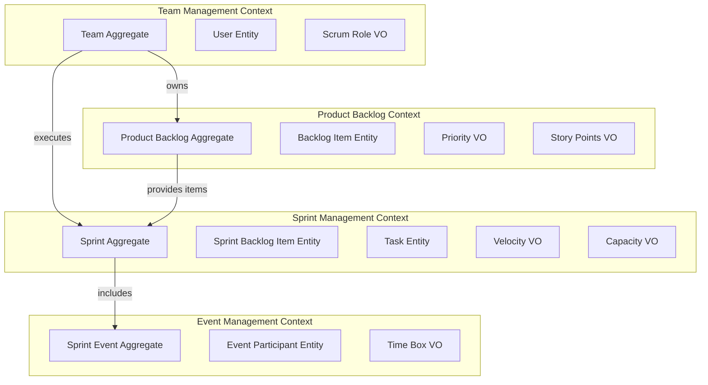

# Domain Model Design: Domain Driven Design with Entity Framework Core

**Created**: 2025-01-27  
**Updated**: 2025-01-01 (PostgreSQL Migration)  
**Status**: Complete  
**Architecture**: Domain Driven Design with Clean Architecture
**Database**: PostgreSQL with Entity Framework Core 8.0 and Docker deployment

## Bounded Context Overview

The ScrumOps domain is organized into four main bounded contexts, each with clear responsibilities and boundaries:



## Shared Kernel

### Base Domain Types
```csharp
// Base aggregate root interface
public interface IAggregateRoot
{
    IReadOnlyList<IDomainEvent> DomainEvents { get; }
    void ClearDomainEvents();
}

// Base domain event
public abstract record DomainEvent(DateTime OccurredOn) : IDomainEvent;

// Base entity
public abstract class Entity<TId> where TId : notnull
{
    public TId Id { get; protected set; } = default!;
    
    protected Entity(TId id) => Id = id;
    protected Entity() { } // For EF Core
    
    public override bool Equals(object? obj) =>
        obj is Entity<TId> entity && Id.Equals(entity.Id);
        
    public override int GetHashCode() => Id.GetHashCode();
}

// Base value object
public abstract class ValueObject
{
    protected abstract IEnumerable<object?> GetAtomicValues();
    
    public override bool Equals(object? obj) =>
        obj is ValueObject other && GetAtomicValues().SequenceEqual(other.GetAtomicValues());
        
    public override int GetHashCode() =>
        GetAtomicValues().Aggregate(1, (current, obj) => 
            current * 23 + (obj?.GetHashCode() ?? 0));
}
```

### Shared Value Objects
```csharp
public record UserId(Guid Value)
{
    public static UserId New() => new(Guid.NewGuid());
    public static implicit operator Guid(UserId userId) => userId.Value;
}

public record TeamId(Guid Value)
{
    public static TeamId New() => new(Guid.NewGuid());
    public static implicit operator Guid(TeamId teamId) => teamId.Value;
}

public class Email : ValueObject
{
    public string Value { get; }
    
    private Email(string value) => Value = value;
    
    public static Email Create(string email)
    {
        if (string.IsNullOrWhiteSpace(email))
            throw new DomainException("Email cannot be empty");
            
        if (!IsValidEmail(email))
            throw new DomainException("Invalid email format");
            
        return new Email(email.ToLowerInvariant());
    }
    
    private static bool IsValidEmail(string email) =>
        new EmailAddressAttribute().IsValid(email);
        
    protected override IEnumerable<object?> GetAtomicValues() { yield return Value; }
}
```

## 1. Team Management Bounded Context

### Team Aggregate Root
```csharp
public class Team : Entity<TeamId>, IAggregateRoot
{
    private readonly List<IDomainEvent> _domainEvents = new();
    private readonly List<User> _members = new();
    
    public TeamName Name { get; private set; }
    public TeamDescription Description { get; private set; }
    public SprintLength SprintLength { get; private set; }
    public Velocity CurrentVelocity { get; private set; }
    public DateTime CreatedDate { get; private set; }
    public bool IsActive { get; private set; }
    
    public IReadOnlyList<User> Members => _members.AsReadOnly();
    public IReadOnlyList<IDomainEvent> DomainEvents => _domainEvents.AsReadOnly();
    
    private Team() { } // EF Core constructor
    
    public Team(TeamId id, TeamName name, TeamDescription description, SprintLength sprintLength)
        : base(id)
    {
        Name = name;
        Description = description;
        SprintLength = sprintLength;
        CurrentVelocity = Velocity.Zero;
        CreatedDate = DateTime.UtcNow;
        IsActive = true;
        
        _domainEvents.Add(new TeamCreatedEvent(Id, Name.Value, CreatedDate));
    }
    
    public void AddMember(User user)
    {
        if (!IsActive)
            throw new DomainException("Cannot add members to inactive team");
            
        if (_members.Any(m => m.Email.Equals(user.Email)))
            throw new DomainException("User with this email already exists in team");
            
        if (HasUserWithRole(user.Role) && user.Role.IsSingletonRole())
            throw new DomainException($"Team already has a {user.Role}");
            
        _members.Add(user);
        _domainEvents.Add(new MemberAddedToTeamEvent(Id, user.Id, user.Role));
    }
    
    public void UpdateVelocity(Velocity newVelocity)
    {
        var previousVelocity = CurrentVelocity;
        CurrentVelocity = newVelocity;
        
        _domainEvents.Add(new TeamVelocityUpdatedEvent(Id, previousVelocity, newVelocity));
    }
    
    private bool HasUserWithRole(ScrumRole role) =>
        _members.Any(m => m.Role.Equals(role));
        
    public void ClearDomainEvents() => _domainEvents.Clear();
}
```

### User Entity
```csharp
public class User : Entity<UserId>
{
    public TeamId TeamId { get; private set; }
    public UserName Name { get; private set; }
    public Email Email { get; private set; }
    public ScrumRole Role { get; private set; }
    public DateTime CreatedDate { get; private set; }
    public DateTime? LastLoginDate { get; private set; }
    public bool IsActive { get; private set; }
    
    private User() { } // EF Core constructor
    
    public User(UserId id, TeamId teamId, UserName name, Email email, ScrumRole role)
        : base(id)
    {
        TeamId = teamId;
        Name = name;
        Email = email;
        Role = role;
        CreatedDate = DateTime.UtcNow;
        IsActive = true;
    }
    
    public void UpdateLastLogin(DateTime loginTime)
    {
        LastLoginDate = loginTime;
    }
    
    public void ChangeRole(ScrumRole newRole)
    {
        if (Role.Equals(newRole))
            return;
            
        Role = newRole;
    }
}
```

### Team Management Value Objects
```csharp
public class TeamName : ValueObject
{
    public string Value { get; }
    
    private TeamName(string value) => Value = value;
    
    public static TeamName Create(string name)
    {
        if (string.IsNullOrWhiteSpace(name))
            throw new DomainException("Team name cannot be empty");
            
        if (name.Length < 3 || name.Length > 50)
            throw new DomainException("Team name must be between 3 and 50 characters");
            
        return new TeamName(name.Trim());
    }
    
    protected override IEnumerable<object?> GetAtomicValues() { yield return Value; }
}

public class ScrumRole : ValueObject
{
    public static readonly ScrumRole ProductOwner = new("Product Owner", true);
    public static readonly ScrumRole ScrumMaster = new("Scrum Master", true);
    public static readonly ScrumRole Developer = new("Developer", false);
    
    public string Name { get; }
    public bool IsSingleton { get; }
    
    private ScrumRole(string name, bool isSingleton)
    {
        Name = name;
        IsSingleton = isSingleton;
    }
    
    public bool IsSingletonRole() => IsSingleton;
    
    protected override IEnumerable<object?> GetAtomicValues() 
    { 
        yield return Name; 
        yield return IsSingleton; 
    }
}

public class SprintLength : ValueObject
{
    public int Weeks { get; }
    
    private SprintLength(int weeks) => Weeks = weeks;
    
    public static SprintLength Create(int weeks)
    {
        if (weeks < 1 || weeks > 4)
            throw new DomainException("Sprint length must be between 1 and 4 weeks");
            
        return new SprintLength(weeks);
    }
    
    public TimeSpan Duration => TimeSpan.FromDays(Weeks * 7);
    
    protected override IEnumerable<object?> GetAtomicValues() { yield return Weeks; }
}
```

## 2. Product Backlog Bounded Context

### ProductBacklog Aggregate Root
```csharp
public class ProductBacklog : Entity<ProductBacklogId>, IAggregateRoot
{
    private readonly List<IDomainEvent> _domainEvents = new();
    private readonly List<ProductBacklogItem> _items = new();
    
    public TeamId TeamId { get; private set; }
    public DateTime CreatedDate { get; private set; }
    public DateTime? LastRefinedDate { get; private set; }
    public BacklogNotes Notes { get; private set; }
    
    public IReadOnlyList<ProductBacklogItem> Items => _items.AsReadOnly();
    public IReadOnlyList<IDomainEvent> DomainEvents => _domainEvents.AsReadOnly();
    
    private ProductBacklog() { } // EF Core constructor
    
    public ProductBacklog(ProductBacklogId id, TeamId teamId) : base(id)
    {
        TeamId = teamId;
        CreatedDate = DateTime.UtcNow;
        Notes = BacklogNotes.Empty;
    }
    
    public void AddItem(ProductBacklogItem item)
    {
        if (_items.Any(i => i.Title.Equals(item.Title)))
            throw new DomainException("Backlog item with this title already exists");
            
        // Auto-assign priority
        var maxPriority = _items.Count > 0 ? _items.Max(i => i.Priority.Value) : 0;
        item.SetPriority(Priority.Create(maxPriority + 1));
        
        _items.Add(item);
        _domainEvents.Add(new BacklogItemAddedEvent(Id, item.Id, item.Title.Value));
    }
    
    public void ReorderItems(IEnumerable<(ProductBacklogItemId ItemId, int NewPriority)> reorderData)
    {
        foreach (var (itemId, newPriority) in reorderData)
        {
            var item = _items.FirstOrDefault(i => i.Id.Equals(itemId));
            if (item != null)
            {
                item.SetPriority(Priority.Create(newPriority));
            }
        }
        
        _domainEvents.Add(new BacklogReorderedEvent(Id, DateTime.UtcNow));
    }
    
    public void MarkAsRefined(DateTime refinedDate, BacklogNotes notes)
    {
        LastRefinedDate = refinedDate;
        Notes = notes;
        
        _domainEvents.Add(new BacklogRefinedEvent(Id, refinedDate));
    }
    
    public void ClearDomainEvents() => _domainEvents.Clear();
}
```

### ProductBacklogItem Entity
```csharp
public class ProductBacklogItem : Entity<ProductBacklogItemId>
{
    public ProductBacklogId ProductBacklogId { get; private set; }
    public ItemTitle Title { get; private set; }
    public ItemDescription Description { get; private set; }
    public AcceptanceCriteria AcceptanceCriteria { get; private set; }
    public Priority Priority { get; private set; }
    public StoryPoints? StoryPoints { get; private set; }
    public BacklogItemStatus Status { get; private set; }
    public BacklogItemType Type { get; private set; }
    public DateTime CreatedDate { get; private set; }
    public DateTime? LastModifiedDate { get; private set; }
    public UserName CreatedBy { get; private set; }
    
    private ProductBacklogItem() { } // EF Core constructor
    
    public ProductBacklogItem(
        ProductBacklogItemId id,
        ProductBacklogId productBacklogId,
        ItemTitle title,
        ItemDescription description,
        BacklogItemType type,
        UserName createdBy) : base(id)
    {
        ProductBacklogId = productBacklogId;
        Title = title;
        Description = description;
        AcceptanceCriteria = AcceptanceCriteria.Empty;
        Priority = Priority.Unassigned;
        Type = type;
        Status = BacklogItemStatus.New;
        CreatedBy = createdBy;
        CreatedDate = DateTime.UtcNow;
    }
    
    public void UpdateDetails(ItemTitle title, ItemDescription description, AcceptanceCriteria acceptanceCriteria)
    {
        Title = title;
        Description = description;
        AcceptanceCriteria = acceptanceCriteria;
        LastModifiedDate = DateTime.UtcNow;
    }
    
    public void EstimateStoryPoints(StoryPoints storyPoints)
    {
        StoryPoints = storyPoints;
        if (Status == BacklogItemStatus.New)
        {
            Status = BacklogItemStatus.Ready;
        }
        LastModifiedDate = DateTime.UtcNow;
    }
    
    public void SetPriority(Priority priority)
    {
        Priority = priority;
        LastModifiedDate = DateTime.UtcNow;
    }
    
    public void MarkAsInProgress()
    {
        if (Status != BacklogItemStatus.Ready)
            throw new DomainException("Only ready items can be moved to in progress");
            
        Status = BacklogItemStatus.InProgress;
        LastModifiedDate = DateTime.UtcNow;
    }
    
    public void MarkAsDone()
    {
        Status = BacklogItemStatus.Done;
        LastModifiedDate = DateTime.UtcNow;
    }
}
```

### Product Backlog Value Objects
```csharp
public class Priority : ValueObject
{
    public int Value { get; }
    
    public static readonly Priority Unassigned = new(0);
    
    private Priority(int value) => Value = value;
    
    public static Priority Create(int priority)
    {
        if (priority < 0)
            throw new DomainException("Priority cannot be negative");
            
        return new Priority(priority);
    }
    
    protected override IEnumerable<object?> GetAtomicValues() { yield return Value; }
}

public class StoryPoints : ValueObject
{
    public int Value { get; }
    
    private static readonly int[] ValidPoints = { 1, 2, 3, 5, 8, 13, 21, 34 };
    
    private StoryPoints(int value) => Value = value;
    
    public static StoryPoints Create(int points)
    {
        if (!ValidPoints.Contains(points))
            throw new DomainException($"Story points must be one of: {string.Join(", ", ValidPoints)}");
            
        return new StoryPoints(points);
    }
    
    protected override IEnumerable<object?> GetAtomicValues() { yield return Value; }
}

public class AcceptanceCriteria : ValueObject
{
    public string Value { get; }
    
    public static readonly AcceptanceCriteria Empty = new(string.Empty);
    
    private AcceptanceCriteria(string value) => Value = value ?? string.Empty;
    
    public static AcceptanceCriteria Create(string criteria)
    {
        var trimmed = criteria?.Trim() ?? string.Empty;
        
        if (trimmed.Length > 5000)
            throw new DomainException("Acceptance criteria cannot exceed 5000 characters");
            
        return new AcceptanceCriteria(trimmed);
    }
    
    public bool IsEmpty => string.IsNullOrWhiteSpace(Value);
    
    protected override IEnumerable<object?> GetAtomicValues() { yield return Value; }
}
```

### Sprint Entity
**Purpose**: Time-boxed iteration for development work
**Table**: `Sprints`

```csharp
public class Sprint
{
    public int Id { get; set; }
    public string Name { get; set; } = string.Empty;
    public string Goal { get; set; } = string.Empty;
    public DateTime StartDate { get; set; }
    public DateTime EndDate { get; set; }
    public SprintStatus Status { get; set; } = SprintStatus.Planning;
    public int Capacity { get; set; }
    public decimal? ActualVelocity { get; set; }
    public string Notes { get; set; } = string.Empty;

    // Foreign Keys
    public int TeamId { get; set; }

    // Navigation Properties
    public virtual Team Team { get; set; } = null!;
    public virtual ICollection<SprintBacklogItem> BacklogItems { get; set; } = new List<SprintBacklogItem>();
    public virtual ICollection<Impediment> Impediments { get; set; } = new List<Impediment>();
    public virtual ICollection<SprintEvent> Events { get; set; } = new List<SprintEvent>();
}

public enum SprintStatus
{
    Planning = 1,
    Active = 2,
    Review = 3,
    Retrospective = 4,
    Completed = 5,
    Cancelled = 6
}
```

**Indexes**:
- `IX_Sprints_TeamId_StartDate`
- `IX_Sprints_Status`
- `IX_Sprints_EndDate`

### SprintBacklogItem Entity
**Purpose**: Product backlog items selected for a specific sprint
**Table**: `SprintBacklogItems`

```csharp
public class SprintBacklogItem
{
    public int Id { get; set; }
    public SprintBacklogStatus Status { get; set; } = SprintBacklogStatus.NotStarted;
    public int OriginalEstimate { get; set; }
    public int RemainingWork { get; set; }
    public DateTime AddedToSprintDate { get; set; }
    public DateTime? CompletedDate { get; set; }
    public string Notes { get; set; } = string.Empty;

    // Foreign Keys
    public int SprintId { get; set; }
    public int ProductBacklogItemId { get; set; }

    // Navigation Properties
    public virtual Sprint Sprint { get; set; } = null!;
    public virtual ProductBacklogItem ProductBacklogItem { get; set; } = null!;
    public virtual ICollection<Task> Tasks { get; set; } = new List<Task>();
}

public enum SprintBacklogStatus
{
    NotStarted = 1,
    InProgress = 2,
    Done = 3,
    Removed = 4
}
```

**Indexes**:
- `IX_SprintBacklogItems_SprintId_Status`
- `IX_SprintBacklogItems_ProductBacklogItemId` (unique)

### Task Entity
**Purpose**: Individual development tasks within sprint backlog items
**Table**: `Tasks`

```csharp
public class Task
{
    public int Id { get; set; }
    public string Title { get; set; } = string.Empty;
    public string Description { get; set; } = string.Empty;
    public TaskStatus Status { get; set; } = TaskStatus.ToDo;
    public int OriginalEstimateHours { get; set; }
    public int RemainingHours { get; set; }
    public DateTime CreatedDate { get; set; }
    public DateTime? StartedDate { get; set; }
    public DateTime? CompletedDate { get; set; }
    public string Notes { get; set; } = string.Empty;

    // Foreign Keys
    public int SprintBacklogItemId { get; set; }
    public int? AssignedToUserId { get; set; }

    // Navigation Properties
    public virtual SprintBacklogItem SprintBacklogItem { get; set; } = null!;
    public virtual User? AssignedToUser { get; set; }
}

public enum TaskStatus
{
    ToDo = 1,
    InProgress = 2,
    Done = 3,
    Blocked = 4
}
```

**Indexes**:
- `IX_Tasks_SprintBacklogItemId`
- `IX_Tasks_AssignedToUserId`
- `IX_Tasks_Status`

### Impediment Entity
**Purpose**: Blocks or issues that prevent team progress
**Table**: `Impediments`

```csharp
public class Impediment
{
    public int Id { get; set; }
    public string Title { get; set; } = string.Empty;
    public string Description { get; set; } = string.Empty;
    public ImpedimentSeverity Severity { get; set; } = ImpedimentSeverity.Medium;
    public ImpedimentStatus Status { get; set; } = ImpedimentStatus.Open;
    public DateTime ReportedDate { get; set; }
    public DateTime? ResolvedDate { get; set; }
    public string Resolution { get; set; } = string.Empty;
    public string Impact { get; set; } = string.Empty;

    // Foreign Keys
    public int SprintId { get; set; }
    public int ReportedByUserId { get; set; }

    // Navigation Properties
    public virtual Sprint Sprint { get; set; } = null!;
    public virtual User ReportedByUser { get; set; } = null!;
}

public enum ImpedimentSeverity
{
    Low = 1,
    Medium = 2,
    High = 3,
    Critical = 4
}

public enum ImpedimentStatus
{
    Open = 1,
    InProgress = 2,
    Resolved = 3,
    Cancelled = 4
}
```

**Indexes**:
- `IX_Impediments_SprintId_Status`
- `IX_Impediments_ReportedByUserId`
- `IX_Impediments_Severity`

### SprintEvent Entity
**Purpose**: Scrum ceremonies and meetings within a sprint
**Table**: `SprintEvents`

```csharp
public class SprintEvent
{
    public int Id { get; set; }
    public SprintEventType Type { get; set; }
    public string Title { get; set; } = string.Empty;
    public DateTime ScheduledDate { get; set; }
    public int DurationMinutes { get; set; }
    public SprintEventStatus Status { get; set; } = SprintEventStatus.Scheduled;
    public string Notes { get; set; } = string.Empty;
    public string Outcomes { get; set; } = string.Empty;

    // Foreign Keys
    public int SprintId { get; set; }

    // Navigation Properties
    public virtual Sprint Sprint { get; set; } = null!;
    public virtual ICollection<SprintEventParticipant> Participants { get; set; } = new List<SprintEventParticipant>();
}

public enum SprintEventType
{
    SprintPlanning = 1,
    DailyScrum = 2,
    SprintReview = 3,
    SprintRetrospective = 4,
    BacklogRefinement = 5
}

public enum SprintEventStatus
{
    Scheduled = 1,
    InProgress = 2,
    Completed = 3,
    Cancelled = 4
}
```

### SprintEventParticipant Entity
**Purpose**: Tracks user participation in sprint events
**Table**: `SprintEventParticipants`

```csharp
public class SprintEventParticipant
{
    public int Id { get; set; }
    public bool Attended { get; set; }
    public string Notes { get; set; } = string.Empty;
    public DateTime? JoinedAt { get; set; }
    public DateTime? LeftAt { get; set; }

    // Foreign Keys
    public int SprintEventId { get; set; }
    public int UserId { get; set; }

    // Navigation Properties
    public virtual SprintEvent SprintEvent { get; set; } = null!;
    public virtual User User { get; set; } = null!;
}
```

**Indexes**:
- `IX_SprintEventParticipants_SprintEventId_UserId` (unique)

## DbContext Configuration

### ScrumOpsDbContext
```csharp
public class ScrumOpsDbContext : DbContext
{
    public ScrumOpsDbContext(DbContextOptions<ScrumOpsDbContext> options) : base(options) { }

    // DbSets
    public DbSet<Team> Teams { get; set; }
    public DbSet<User> Users { get; set; }
    public DbSet<ProductBacklog> ProductBacklogs { get; set; }
    public DbSet<ProductBacklogItem> ProductBacklogItems { get; set; }
    public DbSet<Sprint> Sprints { get; set; }
    public DbSet<SprintBacklogItem> SprintBacklogItems { get; set; }
    public DbSet<Task> Tasks { get; set; }
    public DbSet<Impediment> Impediments { get; set; }
    public DbSet<SprintEvent> SprintEvents { get; set; }
    public DbSet<SprintEventParticipant> SprintEventParticipants { get; set; }

    protected override void OnModelCreating(ModelBuilder modelBuilder)
    {
        base.OnModelCreating(modelBuilder);
        
        // Apply configurations
        modelBuilder.ApplyConfigurationsFromAssembly(typeof(ScrumOpsDbContext).Assembly);
        
        // PostgreSQL specific configurations
        ConfigurePostgreSQLConstraints(modelBuilder);
        ConfigureSchemas(modelBuilder);
    }

    private static void ConfigurePostgreSQLConstraints(ModelBuilder modelBuilder)
    {
        // Configure cascade delete behaviors for PostgreSQL
        foreach (var relationship in modelBuilder.Model.GetEntityTypes()
            .SelectMany(e => e.GetForeignKeys()))
        {
            relationship.DeleteBehavior = DeleteBehavior.Restrict;
        }
    }

    private static void ConfigureSchemas(ModelBuilder modelBuilder)
    {
        // Team Management schema
        modelBuilder.Entity<Team>().ToTable("Teams", "TeamManagement");
        modelBuilder.Entity<User>().ToTable("Users", "TeamManagement");

        // Product Backlog schema
        modelBuilder.Entity<ProductBacklog>().ToTable("ProductBacklogs", "ProductBacklog");
        modelBuilder.Entity<ProductBacklogItem>().ToTable("ProductBacklogItems", "ProductBacklog");

        // Sprint Management schema
        modelBuilder.Entity<Sprint>().ToTable("Sprints", "SprintManagement");
        modelBuilder.Entity<SprintBacklogItem>().ToTable("SprintBacklogItems", "SprintManagement");
        modelBuilder.Entity<Task>().ToTable("Tasks", "SprintManagement");
        modelBuilder.Entity<Impediment>().ToTable("Impediments", "SprintManagement");

        // Event Management schema
        modelBuilder.Entity<SprintEvent>().ToTable("SprintEvents", "EventManagement");
        modelBuilder.Entity<SprintEventParticipant>().ToTable("SprintEventParticipants", "EventManagement");
    }
}
```

### Entity Configurations
Each entity will have a corresponding `IEntityTypeConfiguration<T>` implementation for detailed mapping configuration including:
- Property constraints and validations
- Index definitions
- Relationship configurations
- PostgreSQL-specific settings (schemas, data types, constraints)
- Schema separation for bounded contexts

## Database Initialization and Seeding

### Migration Strategy
- Use EF Core migrations for schema versioning
- Automatic migration application on startup in development
- Manual migration execution in production
- Rollback capabilities for schema changes

### Seed Data
Development environment will include:
- Sample team with all three Scrum roles
- Pre-populated product backlog with various story types
- Active sprint with tasks in different states
- Historical sprint data for velocity calculations
- Sample impediments and resolutions

### Performance Optimizations
- Proper indexing on frequently queried columns
- Connection pooling configuration
- Query optimization with Include() statements
- Pagination for large result sets
- PostgreSQL advanced features for better performance and data integrity

## Validation and Business Rules

### Entity Validation
- Data annotations for basic validation
- Fluent validation for complex business rules
- Database constraints for data integrity
- Custom validation attributes for domain-specific rules

### Business Rule Enforcement
- Sprint capacity cannot exceed historical velocity by more than 20%
- Only Product Owner can modify backlog item priorities
- Tasks cannot be completed if parent story is not done
- Sprint events must be within sprint date boundaries

## Next Steps: API Contracts
With the data model defined, the next phase will create:
- RESTful API endpoints for each entity
- Request/response DTOs
- OpenAPI specifications
- Repository pattern implementation
- Service layer for business logic

---
*Data model designed according to Constitution v1.0.0 standards for quality and maintainability*